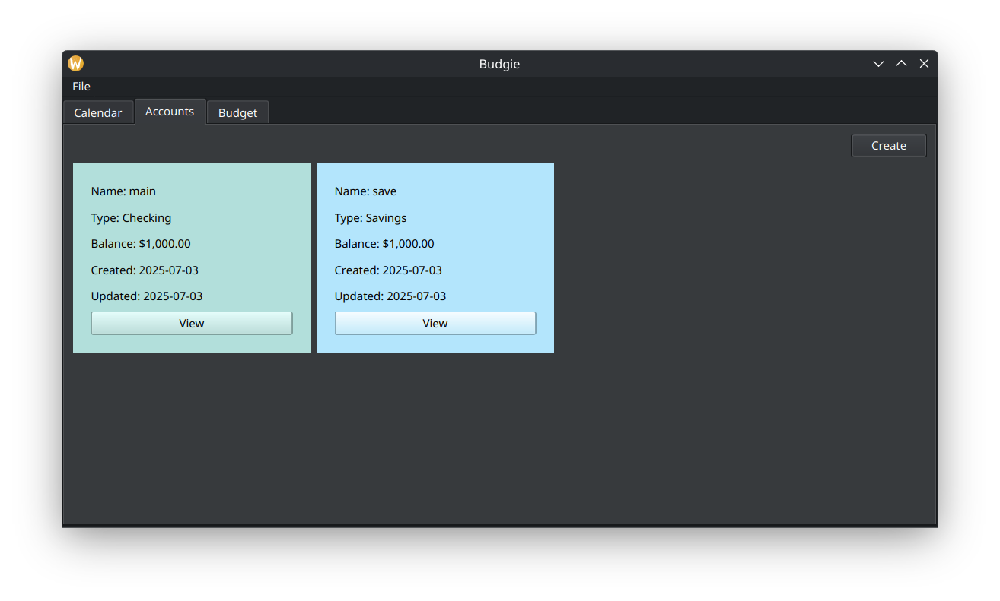
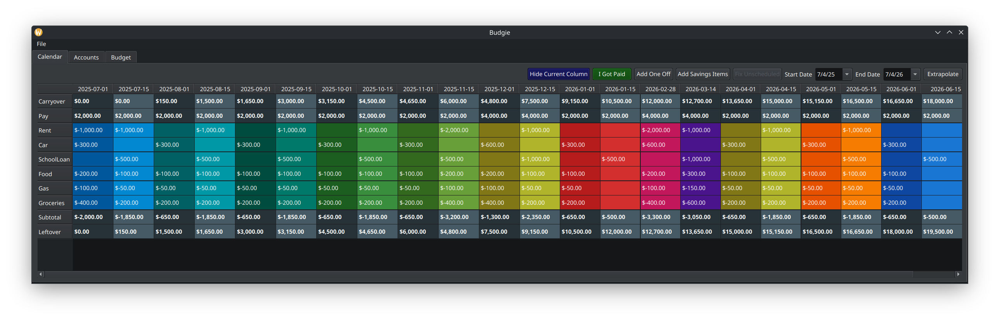

## An in progress project to create a budgeting app for normies with Qt and Python

### It is still a bit bug riddled, but I intend to fix that over the coming months.

https://develop.kde.org/docs/getting-started/python/python-flatpak/  
`flatpak-builder --verbose --force-clean flatpak-build-dir org.kde.budgie.json`  
`flatpak-builder --run flatpak-build-dir org.kde.budgie.json budgie`  
  
# debian  
`sudo apt install build-essential`  
also might need libqt6-dev  
  
# opensuse  
`sudo zypper install -t pattern devel_basis`  
`sudo zypper install libgthread-2_0-0`  
  
`python3 -m venv venv`  
`source venv/bin/activate`  
`pip3 install -r requirements.txt`  
  
to run tests  
`python -m unittest discover -s tests`  
`coverage run -m unittest discover -s tests`  
`coverage report`  
`coverage html`  
  
if you pip3 install...  
`pip3 freeze > requirements.txt`  
  

