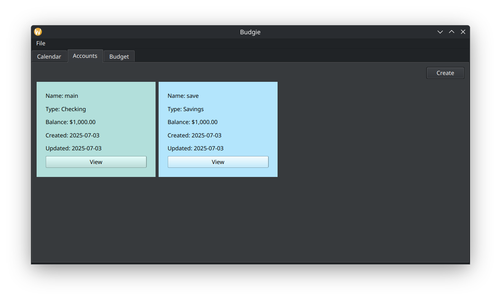
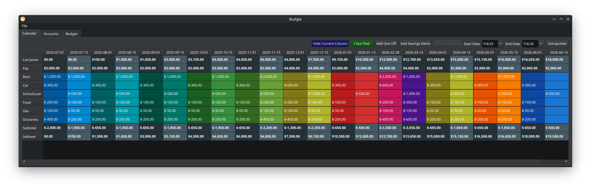
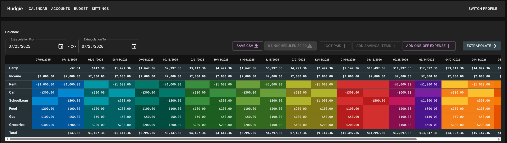

## An in progress project to create a budgeting app for normies with Qt and Python

------------------------------------------------------------------

### QT App

#### It is still a bit bug riddled, but I intend to fix that over the coming months.

Currently it uses a rough attempt at a knapsack problem scheduler.
I'd also like to add an LLM based scheduler.

#### Installation Options

##### Flatpak (Recommended for Distribution)
Build and install as a Flatpak:
```bash
./build-flatpak.sh
```

##### Development Setup (debian)  
`sudo apt install build-essential`  
also might need libqt6-dev  
  
##### opensuse  
`sudo zypper install -t pattern devel_basis`  
`sudo zypper install libgthread-2_0-0`  
  
`python3 -m venv venv`  
`source venv/bin/activate`  
`pip3 install -r requirements.txt`  
  
to run tests  
`python -m unittest discover -s tests`  
`coverage run -m unittest discover -s tests`  
`coverage report`  
`coverage html`  
  
if you pip3 install...  
`pip3 freeze > requirements.txt`  
  



------------------------------------------------------------------

### Server/Client (Home Network Only, NOT SECURE)

#### Option 1: Docker (Recommended)
The easiest way to run the web app is with Docker:

```bash
# Build and start the container
docker-compose up -d

# View logs
docker-compose logs -f

# Stop the container
docker-compose down
```

Navigate to http://localhost:8000

See [DOCKER.md](DOCKER.md) for detailed Docker instructions.

#### Option 2: Manual Setup

**Build or watch the frontend (React)**
```bash
cd frontend
npm run build  # or npm run watch
```

**Serve the API and compiled frontend**
```bash
python serve.py
```

Navigate to http://localhost:8000


